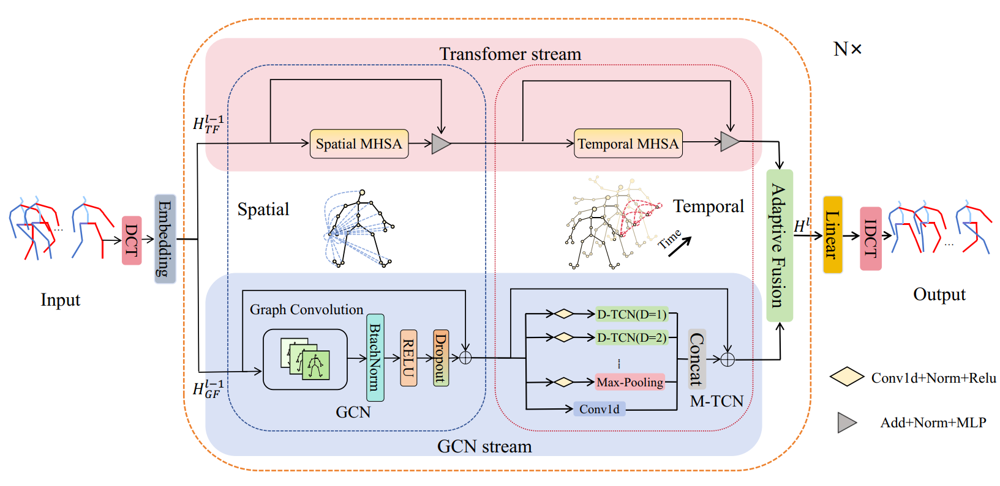

# [Your Paper Title]

> Exploiting Spatio-Temporal Dynamics with a Dual-Stream GCN-Transformer Network for Human Motion Prediction

## Abstract

Accurate human motion prediction is fundamental to applications like intelligent surveillance and human-robot interaction. However, the inherent complexity and stochasticity of human motion present significant challenges. Most existing approaches process spatial and temporal information using two distinct stream separately, resulting in potential semantic misalignment during fusion and limited feature complementarity between streams. To address these limitations, we propose a Dual-Stream GCN-Transformer Network (DSTG-Net) for accurate and robust human motion prediction. DSTG-Net synergistically exploits local and global spatiotemporal patterns: a spatiotemporal Graph Convolutional Network (GCN) stream is employed to extract local temporal patterns and local spatial joint relations, while a spatiotemporal Transformer stream is designed to model global temporal dependencies and long-range spatial interactions among non-adjacent joints. Unlike prior methods that independently extract temporal and spatial information, our method learns features on a unified spatiotemporal scale. This unified learning paradigm effectively mitigates the feature semantic misalignment that arises in separated-modeling approaches. Furthermore, we incorporate a decorrelation loss to promote feature diversity, guiding the model to learn complementary representations. In addition, an adaptive fusion strategy is designed to enable the model to balance local and global information for optimal feature integration by dynamically assigning feature weights.  Extensive experiments show that the proposed model achieves competitive results on three benchmark datasets. Specifically, on Human3.6M, the average per-joint position error (avg-MPJPE) is reduced by 4.37% for short-term prediction and 1.09% for long-term prediction; on CMU-MoCap, the respective reductions are 5.21% and 3.83%; and on 3DPW,  the reductions reach 22.22% and 15.10%. The code is available at: https://github.com/Zephverve/DSTG-Net

## Network Architecture



## Requirements

Recommended environment:

- Python 3.8+
- PyTorch with CUDA support
- NumPy
- SciPy
- Matplotlib
- timm

Install common Python dependencies with:

```bash
pip install numpy scipy matplotlib timm
```

Please install the appropriate PyTorch version separately according to your CUDA environment.

## Project Structure

```text
DSTG-Net
|-- checkpoint/
|-- image/
|   |-- arc.PNG
|-- model/
|   |-- dstg_net.py
|   |-- modules/
|-- utils/
|-- main_h36m_3d.py
|-- main_cmu_3d.py
|-- main_3dpw_3d.py
```

## Data Preparation

Download the datasets and organize them according to the formats expected by this codebase.

### Human3.6M

`--data_dir` should point to the directory that directly contains the subject folders:

```text
[dataset path]
|-- S1
|-- S5
|-- S6
|-- S7
|-- S8
|-- S9
|-- S11
```

The loader reads files in the form:

```text
S1/walking_1.txt
S1/walking_2.txt
...
```

### CMU-MoCap

`--data_dir` should point to the directory that contains `train/` and `test/`:

```text
[dataset path]
|-- train
|   |-- basketball
|   |   |-- basketball_1.txt
|   |   |-- basketball_2.txt
|   |-- basketball_signal
|   |-- directing_traffic
|   |-- jumping
|   |-- running
|   |-- soccer
|   |-- walking
|   |-- washwindow
|-- test
|   |-- basketball
|   |-- basketball_signal
|   |-- directing_traffic
|   |-- jumping
|   |-- running
|   |-- soccer
|   |-- walking
|   |-- washwindow
```

### 3DPW
`--data_dir` should point to:

```text
[dataset path]
|-- train
|   |-- *.pkl
|-- validation
|   |-- *.pkl
|-- test
|   |-- *.pkl
```

## Training

### Train on Human3.6M

```bash
python main_h36m_3d.py --data_dir [dataset path] --input_n 10 --output_n 10 --kernel_size 10 --dct_n 20 --batch_size 32 --test_batch_size 64 --in_features 66 --cuda_idx cuda:0 --d_model 16 --lr_now 0.0005 --epoch 50 --test_sample_num -1
```


## Evaluation

Add `--is_eval` to the corresponding training command.

Example:

```bash
python main_h36m_3d.py --data_dir [dataset path] --input_n 10 --output_n 10 --kernel_size 10 --dct_n 20 --test_batch_size 64 --in_features 66 --cuda_idx cuda:0 --d_model 16 --lr_now 0.0005 --test_sample_num -1 --is_eval
```

To resume training from the last checkpoint, add:

```bash
--is_load
```
Our pre-training parameters cannot be uploaded due to size limitations.

## Acknowledgments

This codebase is built on top of **PGBIG**, with adaptations for the current DSTG-Net implementation.
